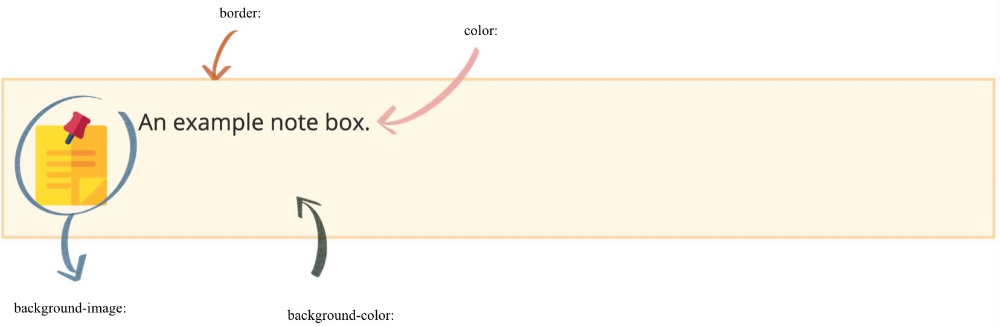

---

title: How to Make Custom Note Boxes for MD Files
subtitle: Using the custom div for the files with .md extension.
date: 
slug: how-to-make-note-boxes
categories:
tags:
- Div Tips
- RStudio
- CSS
authors: 
lastmod: ''
featured: 'featured.jpg'
output:
  blogdown::html_page:
    dev: svg
image:
  caption: ''
  focal_point: Center
  preview_only: true
projects: []
header:
  image: "/code.jpg"
  caption: "Yay! It works!"


---


&nbsp;


<p class="subhead">A few months ago, I started to learn how to create a blog using R Markdown from scracth. Initially, I had absolutely no idea about CSS. Right after launching my own blog, I came across with the <a href="https://bookdown.org/yihui/blogdown/output-format.html"> <b>bookdown website of Yihui</b></a> and saw some really cute colourful boxes there. It seemed like a great way to highlight important information, so I started to search for the code of these colourful boxes. </p>


<style>
div.blue {
  background-image: url('lightbulb.png')
}
</style>

<div class = "blue">
You can use these boxes to customise your blog and draw attention to important parts of your posts!
</div>


Then, I found the [**website of Desirée de Leon**](https://desiree.rbind.io/post/2019/making-tip-boxes-with-bookdown-and-rmarkdown/). I recommend that you check it out on her website as well. She mentions that these divs don't work on blogdown <mark> .md </mark> posts; but I'm quite stubborn and I really liked these, so I struggled for a few days trying to make it work.

&nbsp;


<span class="half_background"> Steps for Creating the Custom Boxes </span>

Most of the steps will be the same with Dr. Desirée's but we'll take some additional steps while using the colourful boxes in our blog posts to make it compatible with <mark> .md </mark> extensions.

First of all, you will need to create a CSS file if you do not already have it. If you are using blogdown with Hugo Academic theme, you need to follow the steps [**over here**](https://wowchemy.com/docs/customization/). Basically, all you need to do is;
 
 1. Create an <mark>assets/scss/</mark> file in your root directory. 
 2. Create a <mark>custom.scss</mark> file on your scss folder.
 
So far so good.

Now we will add our custom divs to the custom.scss file. Go ahead and paste the CSS below into your file.

```r

/* Divs */

div.yellow { 
  background-color: #FEF5E7; padding: 1em;
  margin: 1em 0;
  padding-left: 100px;
  background-size: 70px;
  background-repeat: no-repeat;
  background-position: 15px center;
  min-height: 120px;
  border: solid 2px #FAD7A0;
  }

```
I named this box as <mark>yellow</mark> (see the word after 'div.') so that I can easily remember and find the yellow box when I need to. You can change the name however you like. Accordingly, you may create as many different divs as you like by changing the properties above. Make sure that you give each one a unique name as we will be using those later on.

&nbsp;


<span class="half_background"> How to Customise the Boxes </span>




Especially four lines in our CSS will come in handy while customising our boxes. These are;

- <mark>background-image:</mark> which we will be learning how to use in a minute.
- <mark>border:</mark> you can set this property to dotted, dashed, solid and so on. Check your other options [**here**](https://www.w3schools.com/css/css_border.asp). You can also change the thickness (2px) and colour with this line (#FAD7A0).
- <mark>color:</mark> This spesifically refers to the colour of your text. 
- <mark>background-color:</mark> You can use any colour of your liking for the background, both HTML and RGB colour codes would work.

&nbsp;


<span class="half_background"> The Background Image </span>

This is where our paths are seperated with Dr. Desirée. If you fail to add your icon in the box and use your divs as instructed on her blog, try these steps instead;

1. Choose an [**icon**](https://www.flaticon.com) of your liking and save it as .png or .jpg (flaticon has many great options but if you want to use another website for this, just make sure that the icon has a transparent background).
2. Add this image in the same file as your .md blog post.
3. Open up your <mark>.md file</mark> and paste the inline style below.

```r
<style>
div.yellow {
  background-image: url("your_icon_name.png");
}
</style>
```

This chunk will add the background image to our custom boxes.

Now we can use our cute custom divs by typing this on our post;

```r
<div class = "yellow">
An example note box.
</div>
```

Note that we will need to paste the last two code chunks into our blog posts whenever we want to use them. This may not be the most efficient way to use the pretty boxes. However, it gives us the freedom of changing the icons at any given time without affecting the boxes in other blog posts.