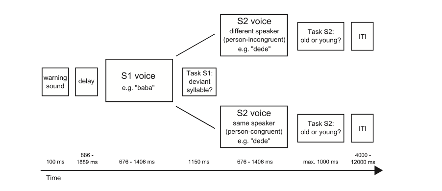

---

title: How fMRI is Used in the Visual Perception Studies?
subtitle: An overview of its experimental designs and ways to compensate the limitations.
date: 2020-10-14
slug: how-fmri-is-used
categories:
- Neuroscience
tags:
- Visual Perception
- Cross-modal Plasticity
- fMRI
authors: [admin]
lastmod: ''
featured: '/post/paper_review/featured.jpg'
output:
  blogdown::html_page:
    dev: svg
image:
  caption: ''
  focal_point: Center
  preview_only: true
projects: []

---

&nbsp;

 
 
For the purpose of this essay, I choose a quite recent paper from one of my favorite topics. The article is exploring whether or not fusiform gyrus activates while late blind individuals are performing a voice recognition task1. First part of this piece will briefly summarise the study while second and third divisions are going to focus on explaining the choice of experimental design and possible ways to overcome the limitations that researchers face while using fMRI.

&nbsp;

## Summary of the Study

 Researchers recruited 9 late blind and 7 gender and age matched sighted individuals. For the purpose of the study, only blind individuals with an onset above 14 years and who were blind for at least 7 years were selected. 

As the stimuli, researchers used pseudowords which were vocalized by 12 actors. Purpose of using pseudowords was isolating the effect of voice identity effect from confounders like semantic associations etc. Each trial consisted two voice stimuli (S1 - S2), in which stimuli 2 (S2) was either person congruent (50%) or person incongruent (50%). Among these, %50 were gender congruent and %50 were gender incongruent. In addition, researchers stated that age congruent trials were at the same time response congruent (S1 primed response to S2) and age incongruent trials were at the same time response incongruent (S1 did not prime response to S2). To measure the effects, two separate event-related designs for person congruent and person incongruent trials was administered. Researchers also noted that in order to ensure attention to S1, oddball paradigm has been used. 

_Figure 1. Scheme of the experimental design._

__Note.__ _Reprinted from Crossmodal plasticity in the fusiform gyrus of late blind individuals during voice recognition, by Hölig et al., Copyright 2014 by Elsevier_

&nbsp;

Priori to the experiment, participants were familiarized with voices of the actors and their disyllabic names. Training session had 2 stages: voice familiarization and voice matching. In voice matching stage participants were asked whether S1 and S2 belonged to the same actor. For each response they have received feedback. Training was ended immediately after each participant reached 85% correct responses. However, during the experiment; instead of simply matching the identity of a person participants were asked if S2 was old or young. Researchers aimed to dissociate the effect of voice identity from primed response by using this setup.

&nbsp;

### Findings

Researchers aimed to reveal if voice identification changes in late blindness as it changes in congenital blindness2. They found that blind individuals learn voice identities faster than sighted participants, yet the groups did not perform significantly better in the voice matching task after the training phase. However, blind participants’ occipital cortex showed grater BOLD response while performing voice identification task. In addition, only in late-blind group anterior fusiform gyrus was activated by this task. Researchers concluded that late blindness causes the same changes as congenital blindness, as both groups activated the same part of fusiform gyrus. In addition, it was concluded that this indicates a reorganization in the occipital lobe of blind individuals. These results were also similar to significant amount of studies that revealed crossmodal activation in V1 in late blind subjects.

&nbsp;

## Blocked vs. Event Related Design

Researchers’ main concern was dissociating the effects of voice identity from automated responses, which in turn could generate neater results. Event related design is considered particularly useful when it comes to implementing oddball paradigm and construct a temporally unpredictable series of stimuli3. This is an experimental design in which the sequence of repetetive stimuli are irregularly and infrequently interrupted by deviant stimuli4 in order to keep participants focused.

 It also has the advantage of enabling the categorization of events3, by making it possible to sort the times when participant recognized the voice stimulus and when they did not. This categorization is essential considering the study’s aim is to localize the region which is involved in voice *recognition*. In addition, event-related design enables isolating related cognitive processes. While comparing the groups, researchers were able to equate the performances by comparing only correct trials. That is, it is possible to compare correct trials of the first group to the correct trials of the second group, even if the number of correct trials is not equal. This way, data will be clear from irrelevant activations caused by incorrect trials. Another preferable feature of event-related design is that it measures the signal change which is related to a single stimulus. This allows researchers to assign a signal change to a particular event, as well as correlating a behaviour with neural responses and randomising the stimuli5.

On the other hand, blocked-design is considered as superior to event-related design because it provides with a larger BOLD signal in addition to offering a high detection power3. This is an especially important advantage as the fMRI signal is inherently noisy. Yet, it has a non-negligible disadvantage; it allows participants to predict the order of the stimuli and type of trials, which makes it impossible to run oddball paradigm. It would also disable the categorization of events by presenting stimuli continuously in single trial. Moreover, block design averages brain activation over a prolonged period of time; therefore, is quite inefficient when regressors are temporally proximal. Consequently, it is unable to isolate cognitive events as well3. However, researchers in this case needed a design which allows isolation of the primed response from voice recognition and this was achieved by creating a random series of age-congruent and age-incongruent trials, which would not be possible with blocked design. 

&nbsp;

## What We Can Do and What We Cannot Do with fMRI

The limitations of fMRI are not related to physics or poor engineering, and are unlikely to be resolved by increasing the sophistication and power of the scanners; they are instead due to the circuitry and functional organization of the brain, as well as to inappropriate experimental protocols that ignore this organization. 

 Logothetis, Nature, 2008 

### The Causality Problem

While working with fMRI, an important question should be taken into consideration. Does observing activation in an area means that it is related with the task? fMRI diverges from lesion method or Transcranial Magnetic Stimulation (TMS) since it does not only identify the brain regions that are necessary in performing a particular task, but it also marks the areas that are involved in that task anyway. Meaning that activated areas might not be critical at all. When interpreting the outcomes of fMRI, it is assumed that a cognitive process activates hemodynamic response of a particular region. That is, it might be anticipated that if the activated region happens to get damaged, corresponding process also disappears. However, while the data of this experiment can tell us that during a voice recognition task occipital cortex is activated in late blinds, it cannot tell us if the activation is an epiphenomenon related to the loss of visual input or is it indeed task related. In other words, using solely fMRI to search for evidence of crossmodal plasticity in occipital cortex of late blinds may lead researchers to make inaccurate inferences since fMRI is unable to demonstrate causal relationship. A possible way to examine whether or not blindness causes reorganization in the occipital cortex by assigning other modalities like auditory input, may be using interference methods like TMS when the area is up to 6 cm into the cortical surface. 

TMS technique is usually referred as _virtual lesion_6 since stimulation of cortical activity disrupts task performance in a similar manner to brain lesions, only temporarily. Mechanism underlying TMS is to cause changes in the firing rate of neurons which normally is coherent with surrounding neurons7. When disruption of activity causes impairment of a function, it means that stimulated region is necessary to utilize the function normally. Some great advantages of using TMS instead of lesion cases are that; 

* Patients are likely to go through a brain re-organization after a traumatic injury, which is not the case for virtual lesions.
* Virtual lesions are controlled and **relatively** more precise in terms of location and size.  

A good example of using TMS in crossmodal plasticity in case of visual deprivation was conducted by Cohen et al. (1997), assessing the role of visual cortex over the course of Braille reading in blind participants. Prior to this study, fMRI studies of congenitally and early blind individuals documented activation of primary visual cortex while performing Braille reading. However, this activation might have been associated with an epiphenomenon of tactile input processing as well as compensatory crossmodal plasticity. Therefore, Cohen et al. applied TMS to the occipital cortex (V1) of blind and sighted subjects while they are reading Braille with their index fingers. As a result, applying TMS to V1 found to be disruptive to the tactile perception and caused errors in reading in blind subjects but not in the sighted. 

It should be noted that a large portion of fusiform gyrus lies outside of the range for TMS applications and this may lead to a false negative result. Therefore, TMS cannot be the definite solution for the causation problem in cases like this.

&nbsp;

### Temporal Resolution Problem

For many research questions, it is essential to measure the timing of the neuronal activity with high accuracy, in other words with high *temporal resolution*. It can be argued that fMRI has an intermediate temporal resolution compare to other techniques such as PET and EEG. It can distinguish events that occur with a few seconds of intervals, and this can be improved to a certain extent (e.g. using an interleaved stimulus presentation). However, this technique still isn’t suitable for testing time-related hypotheses because the hemodynamic response is a lot slower than the neuronal activity. Therefore, researchers sometimes use a complementary technique with high temporal resolution which is called Event Related Potential, or ERP. 

In this case, researchers can answer which areas of the brain are involved in voice recognition in blind, but exploring how sub-processes of voice recognition may contribute to the superiority of blind participants would require a better temporal resolution. Indeed, the same researchers conducted an ERP study to answer this question8. Using the exact same experimental design, they were able to dissociate and compare how fast the participants are in processing and correctly classifying the person-congruent and person-incongruent stimuli. As a result, they found that blind participants were significantly faster in processing person-incongruent stimuli as well as achieving a higher number of correct classification. Thus, they were able to conclude that blind individuals are more efficient in recognizing voices overall since they are faster and better at recognizing the ***person-incongruent*** trials.

One should keep in mind that all of the neuroimaging techniques has limitations, one way or another. However, as Logothetis stated; most of the problems in neuroscience arises not due to the techniques themselves, but because of the way that our brain is wired.

&nbsp;

*****

## References

1.  Hölig, C., Föcker, J., Best, A., Röder, B. & Büchel, C. Crossmodal plasticity in the fusiform gyrus of late blind individuals during voice recognition. Neuroimage (2014) doi:10.1016/j.neuroimage.2014.09.050.
2.  Hölig, C., Föcker, J., Best, A., Röder, B. & Büchel, C. Brain systems mediating voice identity processing in blind humans. Hum. Brain Mapp. (2014) doi:10.1002/hbm.22498.
3.  Garavan, Hugh, and Kevin Murphy. "Experimental design." fMRI techniques and protocols. (2016). 137-153.
4.  Huettel, S. A. & McCarthy, G. What is odd in the oddball task? Prefrontal cortex is activated by dynamic changes in response strategy. Neuropsychologia (2004) doi:10.1016/j.neuropsychologia.2003.07.009.
5.  Faro, S. H. & Mohamed, F. B. BOLD fMRI: A guide to functional imaging for neuroscientists. BOLD fMRI: A Guide to Functional Imaging for Neuroscientists (2010). doi:10.1007/978-1-4419-1329-6.
6.  Pascual-Leone, A., Bartres-Faz, D. & Keenan, J. P. Transcranial magnetic stimulation: Studying the brain-behaviour relationship by induction of ‘virtual lesions’. Philos. Trans. R. Soc. B Biol. Sci. (1999) doi:10.1098/rstb.1999.0476.
7.  Fox, M. D., Halko, M. A., Eldaief, M. C. & Pascual-Leone, A. Measuring and manipulating brain connectivity with resting state functional connectivity magnetic resonance imaging (fcMRI) and transcranial magnetic stimulation (TMS). NeuroImage (2012) doi:10.1016/j.neuroimage.2012.03.035.
1.	Föcker, J., Best, A., Hölig, C. & Röder, B. The superiority in voice processing of the blind arises from neural plasticity at sensory processing stages. Neuropsychologia (2012) doi:10.1016/j.neuropsychologia.2012.05.006.
  

&nbsp;

 
 
## Further Reading

Logothetis, N. K. What we can do and what we cannot do with fMRI. Nature (2008) doi:10.1038/nature06976.

